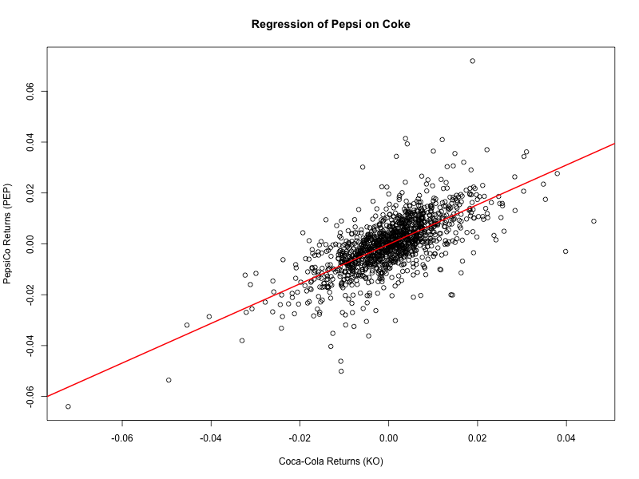
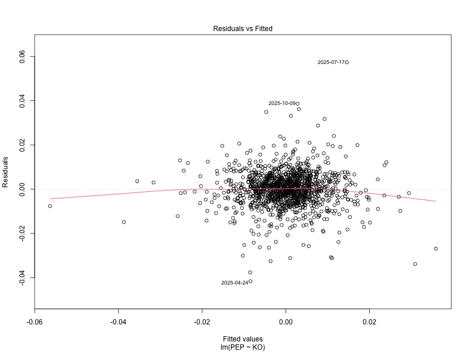
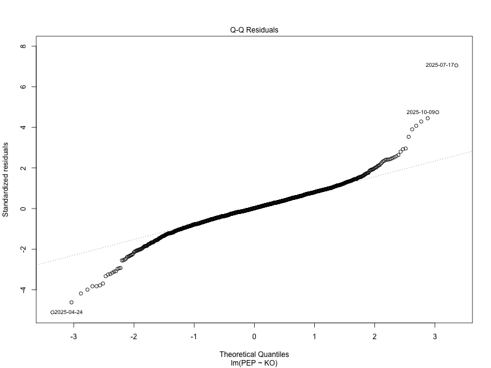

# Coke vs. Pepsi Pair Regression Analysis


## Overview

A data pipeline analyzing the linear relationship between Coca-Cola (KO) and PepsiCo (PEP) and checking the assumptions of the least squares model.


## Repository Structure

```text
pair-regression-ko-pep/
├── data/
│   └── coke_pepsi_returns.csv
├── outputs/
│   ├── qq_plot.png
│   ├── regression_plot.png
│   └── residuals_fitted.png
├── README.md
└── scripts/
    ├── analysis.R
    └── fetch_data.py
```


## Pipeline

1. **Python:** Fetches data for KO and PEP from `yfinance`, calculates daily log returns, and exports the data.

2. **R:** Fits an OLS regression model (`PEP~KO`), evaluates model assumptions, and outputs diagnostic plots.


## Quantitative Results

1. **Sample Size ($N$):** 1,253 observations (2021-2026)

2. **Slope ($\beta_1$):** `0.7785367` - Statistically significant ($t = 33.787, p < 2\text{e}-16$)

3. **Intercept ($\beta_0$):** `-0.0001493` - Statistically insignificant ($t = -0.649, p = 0.517$)

4. **R-squared ($R^2$):** `0.4769` - Indicates $47.69$% of the variance in Pepsi is explained by Coke.


## Model Assumptions

1. **Linearity:** The scatterplot (`regression_plot.png`) confirms a strong, positive linear correlation between the log returns of these two stocks. Thus, the linearity assumption is met.

2. **Homoscedasticity:** Checked via the residuals vs. fitted plot (`residuals_fitted.png`). The plot confirms the variance of residuals remains relatively stable across fitted values and the homoscedasticity assumption is met.

3. **Independence:** The Durbin-Watson test confirms there is no correlation in the residuals (D-W Statistic $= 2.018158, p = 0.71$), and the independence assumption is met.

4. **Normality:** Checked via `qq_plot.png`. The Q-Q plot shows moderately high kurtosis, consistent with the fact that asset returns experience more extreme "tail" events than a normal distribution. Despite this, the central limit theorem ensures the distribution of our regression coefficients remain normal and the normality assumption is met. 


## Visualizations

### Regression Plot


### Residual Diagnostics





## Usage 

1. Clone the repository
```bash
git clone https://github.com/sawyer-k-gray/pair-regression-ko-pep.git
cd pair-regression-ko-pep
```

2. Run the Python and R scripts
```bash
python scripts/fetch_data.py
Rscript scripts/analysis.R
```


